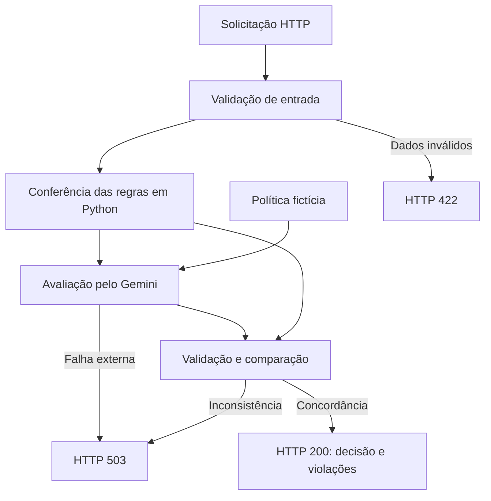

# Travel Approval AI

Prova de conceito de uma API que avalia solicitações de viagem com
um modelo de linguagem e confere o resultado usando regras em Python.

Desenvolvida para o desafio técnico de Data Science / GenAI da EDS.

## Premissas

A política original não foi disponibilizada. Conforme autorização
recebida no processo seletivo, foi criada uma política fictícia
exclusivamente para demonstração.

As decisões são válidas apenas para essa política e não representam
necessariamente as regras reais da empresa.

Política completa: [docs/travel_policy.md](docs/travel_policy.md).

## Regras de demonstração

| ID | Regra |
|---|---|
| POL-001 | Duração máxima de 15 períodos de 24 horas |
| POL-002 | Orçamento total máximo de R$ 5.000,00 |
| POL-003 | Origem e destino diferentes, ignorando maiúsculas/minúsculas e espaços nas extremidades |

Exatamente 15 dias e R$ 5.000,00 são permitidos.

O orçamento representa o custo total estimado da viagem.
As mesmas regras se aplicam a todos os departamentos.

## Arquitetura e abordagem

1. O FastAPI recebe a solicitação.
2. O Pydantic valida campos, datas e orçamento.
3. O código verifica as regras objetivas da política.
4. O Gemini recebe o documento da política e os dados necessários.
5. A resposta estruturada do modelo é validada pelo Pydantic.
6. Os IDs retornados pelo LLM são comparados aos identificados pelo código.
7. Havendo concordância, a API retorna a decisão e as violações.

O resultado calculado pelo código não é enviado ao LLM.
As avaliações são realizadas separadamente.

Falhas, respostas inválidas, regras duplicadas ou divergências impedem
a emissão de uma decisão e resultam em HTTP 503.



## Decisões técnicas

- **FastAPI:** API HTTP com documentação interativa.
- **Pydantic:** validação da entrada e da resposta do modelo.
- **Decimal:** representação decimal do orçamento.
- **Datas com fuso horário:** comparação de instantes e cálculo da duração em UTC.
- **Google Gen AI SDK:** integração direta com o Gemini.
- **Resposta estruturada:** o LLM retorna IDs de regras, em vez de uma decisão em texto livre.
- **Conferência determinística:** impede uma decisão quando o LLM diverge das regras implementadas.
- **Mensagens fixas:** as justificativas públicas são associadas aos IDs das regras.
- **Pytest:** testes automatizados com substituição das chamadas externas.

A política é pequena e enviada integralmente ao modelo.
Não foram utilizados RAG, banco vetorial ou LangChain, pois não eram
necessários para esse escopo.

As três regras poderiam ser resolvidas somente em código.
O LLM foi incorporado conforme o requisito do desafio, interpretando
a política textual sob uma verificação independente.

## Requisitos

- Git.
- Python: ambiente de desenvolvimento validado com Python 3.14.6.
- Chave da Gemini API.
- Acesso à internet e cota disponível para o modelo configurado.

As versões das dependências estão registradas em `requirements.txt`.
A disponibilidade do modelo e os custos dependem da conta e do provedor.

## Instalação

Clone o repositório:

```bash
git clone https://github.com/RafaDavila/travel-approval-ai.git
cd travel-approval-ai
```

Crie e ative o ambiente virtual.

### Windows — PowerShell

```powershell
python -m venv .venv
.\.venv\Scripts\Activate.ps1
```

### Linux / macOS

```bash
python3 -m venv .venv
source .venv/bin/activate
```

Instale as dependências:

```bash
python -m pip install -r requirements.txt
```

## Configuração

Crie uma chave no [Google AI Studio](https://aistudio.google.com/app/apikey).

Copie `.env.example` para `.env`.

No PowerShell:

```powershell
Copy-Item .env.example .env
```

No Linux / macOS:

```bash
cp .env.example .env
```

Preencha o arquivo `.env`:

```dotenv
GEMINI_API_KEY=sua_chave_aqui
GEMINI_MODEL=gemini-3.6-flash
```

Não publique a chave. O arquivo `.env` está incluído no `.gitignore`.

O modelo foi utilizado nas avaliações manuais registradas.
Listar um modelo no catálogo não garante acesso para geração
nem disponibilidade de cota.

Variáveis já definidas no ambiente têm prioridade sobre o arquivo `.env`.
Após alterar a configuração, reinicie o servidor.

## Execução local

Na raiz do projeto:

```bash
python -m uvicorn app.main:app --reload
```

- Documentação interativa: http://127.0.0.1:8000/docs
- Verificação básica do servidor: http://127.0.0.1:8000/health

O parâmetro `--reload` é destinado ao desenvolvimento.

`GET /health` verifica somente se a aplicação está respondendo.
Não verifica a disponibilidade do Gemini.

## Avaliar uma viagem

Use `POST /travel-requests/evaluate`.

Na documentação interativa, selecione a rota, clique em
“Try it out”, insira o JSON e clique em “Execute”.

### Exemplo de entrada

```json
{
  "employee_name": "David Duarte",
  "department": "Financeiro",
  "origin": "Rio de Janeiro",
  "destination": "Recife",
  "departure_date": "2026-10-01T09:00:00-03:00",
  "return_date": "2026-10-05T18:00:00-03:00",
  "estimated_budget": "6000.00"
}
```

O orçamento aceita uma string decimal ou um número JSON.
Use ponto como separador decimal, sem símbolo monetário.

### Exemplo de resposta — HTTP 200

```json
{
  "accepted": false,
  "violated_policies": [
    "POL-002: Orçamento total máximo de R$ 5.000,00 excedido."
  ]
}
```

Uma solicitação aprovada retorna:

```json
{
  "accepted": true,
  "violated_policies": []
}
```

### Códigos HTTP

| Código | Significado |
|---|---|
| 200 | Avaliação concluída, com aprovação ou reprovação |
| 422 | Dados inválidos; o LLM não é chamado |
| 503 | Avaliação indisponível ou inconsistente; nenhuma decisão é emitida |

HTTP 200 significa que a avaliação foi concluída.
A aprovação depende do campo `accepted`.

Uma resposta HTTP 503 pode ter o formato:

```json
{
  "detail": "Não foi possível concluir a avaliação. Tente novamente mais tarde."
}
```

## Testes

```bash
python -m pytest -q
```

Resultado registrado: **34 testes passando**.

Os testes cobrem:

- Validação dos dados de entrada.
- Limites de duração e orçamento.
- Comparação de origem e destino.
- Aprovação e reprovação.
- Múltiplas violações.
- Divergências entre código e LLM.
- IDs duplicados.
- Timeout.
- Rejeição de entradas inválidas antes da chamada externa.

Os testes da API simulam o LLM e não consomem cota do Google.
Eles não medem a precisão do modelo real.

As avaliações reais e a falha transitória observada estão registradas em
[docs/validation_results.md](docs/validation_results.md).

## Segurança e limitações

- Nome e departamento não são enviados ao LLM, pois não alteram as regras.
- Origem, destino, datas e orçamento são enviados à API do Google.
- Os campos da solicitação são tratados no prompt como dados, não instruções.
- A verificação em código reduz o risco de decisões incorretas para estas regras,
  mas não constitui proteção geral contra todos os ataques a LLMs.
- A aplicação depende da disponibilidade e da cota da API externa.
- O cliente está configurado com timeout de 60.000 milissegundos.
- Não há fila ou fluxo implementado de revisão humana.
  Em caso de divergência, a API apenas informa a necessidade de revisão.
- Não há autenticação, limitação de requisições ou persistência.
  Esta versão é uma demonstração local, não um serviço pronto para produção.
- Alterações na política exigem atualizar o documento, as regras em Python,
  as mensagens e os testes.
- A amostra de avaliações reais é pequena e não comprova precisão geral.

Foram observados três avisos de descontinuação em dependências:
Starlette/httpx, Starlette/AnyIO e Google Gen AI SDK/Python.
Eles não impediram a execução dos 34 testes no ambiente registrado.

## Estrutura principal

- `app/main.py`: rotas HTTP.
- `app/schemas.py`: modelos de entrada e saída.
- `app/policy.py`: conferência das regras.
- `app/llm.py`: integração com o Gemini.
- `app/services.py`: coordenação e comparação das avaliações.
- `tests/`: testes automatizados.
- `docs/travel_policy.md`: política fictícia.
- `docs/validation_results.md`: resultados observados.
- `.env.example`: modelo de configuração.
- `requirements.txt`: versões das dependências.